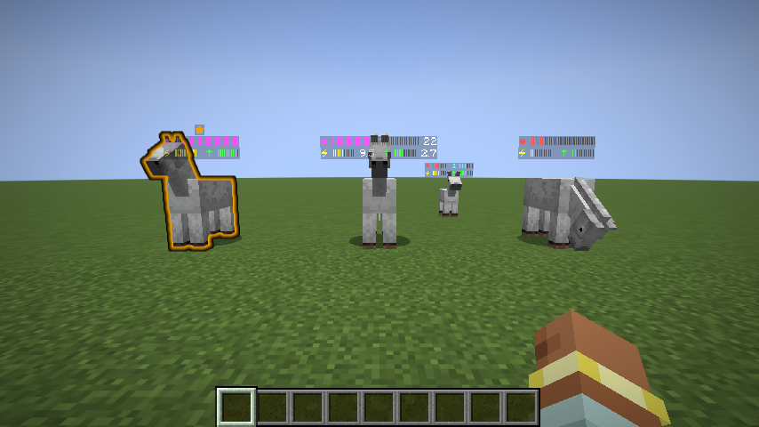
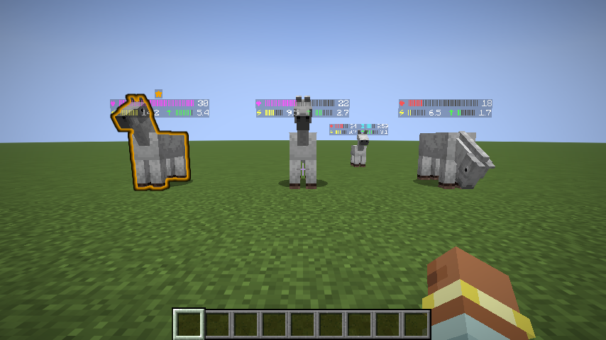
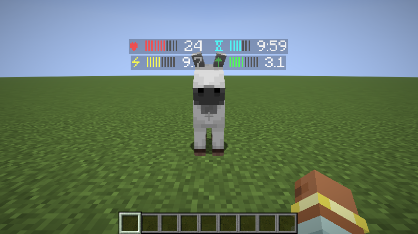
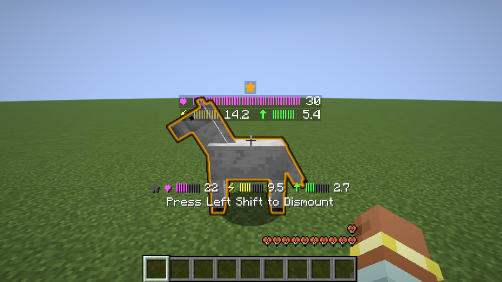

# Stallium

Клиентский Fabric-мод: показывает характеристики лошадей прямо в мире,
подсвечивает лучшую золотой обводкой (как от спектральной стрелы) и
подсказывает пару для разведения.

<table>
<tr>
<td width="50%"></td>
<td width="50%"></td>
</tr>
<tr>
<td align="center"><sub>Статы над лошадьми, лучшая обведена</sub></td>
<td align="center"><sub>Shift: точные числа после полосок</sub></td>
</tr>
<tr>
<td width="50%"></td>
<td width="50%"></td>
</tr>
<tr>
<td align="center"><sub>Жеребёнок: таймер роста</sub></td>
<td align="center"><sub>Верхом: HUD и лучшая рядом</sub></td>
</tr>
</table>

## Возможности

- Над каждой лошадью в радиусе (по умолчанию 32 блока) — компактный блок в
  стиле ванильных ников; строки выровнены друг под другом (полоска здоровья
  растягивается до ширины нижнего ряда):
  ```
             ★              ← корона: только у лучшей рядом
  ♥ |||||||||||||||||····   ← здоровье
  ⚡ |||||||···  ↑ ||||||···  ← скорость и прыжок
  ```
  - **⚡ скорость** (жёлтая), **↑ высота прыжка** (зелёная), **♥ здоровье**
    (красная; **фиолетовая** — лошадь в паре для разведения); полоска —
    насколько стат близок к максимуму генерации.
- **Точные числа** после полосок (`♥ |||||||| 30`): у лошади под прицелом —
  всегда; по **Shift** (пешком) — у всех сразу. В настройках полоски можно
  выключить — тогда остаются только числа.
- **Таймер роста жеребят**: в строке здоровья, ровно над блоком прыжка —
  `⌛` с полоской-прогрессом роста (по Shift — остаток времени, например
  `9:59`). В одиночной игре — точный (из встроенного сервера, учитывает всё);
  на серверах — оценка: отсчёт 20:00 с увиденного рождения минус ваши
  кормления (пшеница −20 с, сахар −30 с, яблоко/морковь/зол. морковь −60 с,
  сноп сена −3 мин, золотые яблоки −4 мин); у жеребят, чьё рождение мод не
  видел, таймер не показывается.
- Лучшая лошадь в радиусе 48 блоков подсвечивается **золотой обводкой**
  (ванильный glow-эффект, виден сквозь стены).
- Верхом: над хотбаром тот же формат для вашей лошади —
  `★ ♥ |||||| 22  ⚡ |||||||| 9.5  ↑ |||| 2.7` (полоски и цифры); ★ золотая,
  когда ваша лошадь — лучшая рядом. Если лучше другая — она обведена в мире.
- **Подсказки для разведения** (опция): у пары взрослых лошадей (или ослов)
  с лучшим ожидаемым жеребёнком здоровье окрашено фиолетовым.
  Расчёт — по ванильной формуле потомства `createOffspringAttribute`:
  стат жеребёнка = среднее родителей ± (|разница родителей| + 30 % диапазона)
  × случайное качество, перелёт за максимум «отражается» вниз. Поэтому
  выгодны два сильных и **сбалансированных** родителя, а не один экстремальный.
- Ослы, мулы, скелеты- и зомби-лошади участвуют в сравнении «лучшей»; ламы и
  верблюды показывают только скорость и здоровье; жеребята показывают статы,
  но «лучшими» и «парой» не считаются (мулы бесплодны — в пары не входят).
- Локализация: русский и английский.

Числа соответствуют [ру-вики](https://ru.minecraft.wiki/w/Лошадь): скорость
бл/с = атрибут × 43 (10.75 × (0.45 + …)), высота прыжка — симуляция ванильной
физики `v = (v − 0.08) × 0.98` (0.4 → 1.15 бл; 1.0 → 5.92 бл), здоровье
15–30 HP. «Лучшая» — сводный балл: скорость 45 %, прыжок 35 %, здоровье 20 %
(нормировка по диапазонам генерации `AbstractHorse`).

## Настройки

Клавиша **H** (меняется в управлении) или кнопка мода в ModMenu:
надписи вкл/выкл, радиус надписей (8–64), обводка лучшей, полоски,
числа при наведении, подсказки разведения. Хранятся в `config/stallium.json`.

## Версии

Полностью клиентский мод (на сервер ставить не нужно, работает на любых
серверах). Требует Fabric Loader ≥ 0.19 и Fabric API.

| Сборка                                | Minecraft            |
|---------------------------------------|----------------------|
| `stallium-1.0.0+26.1.jar`             | 26.1, 26.1.1, 26.1.2 |
| `stallium-1.0.0+26.2.jar`             | 26.2                 |
| `stallium-1.0.0+26.3.jar`             | 26.3                 |
| `stallium-1.0.0+26.4-snapshot-2.jar`  | 26.4-snapshot-2      |

Скачать — на [Modrinth](https://modrinth.com/mod/stallium); положить подходящий
JAR в `.minecraft/mods` рядом с Fabric API. Локальная сборка — `build/libs/`.

## Сборка

```bash
./gradlew build                              # цель по умолчанию — 26.1
./gradlew build -PtargetMc=26.2
./gradlew build -PtargetMc=26.3
./gradlew build -PtargetMc=26.4-snapshot-2
```

Готовые JAR появляются в `build/libs/`. Список целей — мапа `targets`
в `build.gradle`.

Скриншот-проверка (создаёт плоский мир, спавнит трёх лошадей с разными
статами, садится на среднюю, открывает настройки и делает снимки в
`build/run/clientGameTest/screenshots/`):

```bash
./gradlew runClientGameTest
```

Обновить скриншоты в README и галерее Modrinth — то же самое, но с
переносом результата в `docs/screenshots/` (Sync: лишнее удаляется, новое
и изменившееся — перезаписывается):

```bash
./gradlew updateScreenshots
```

## Релиз

1. В `docs/CHANGELOG.md` перенести пункты из `[Unreleased]` в новый раздел
   `[x.y.z] - YYYY-MM-DD`, завести пустой `[Unreleased]` сверху.
2. Поднять `mod_version` в `gradle.properties`.
3. Закоммитить, запушить.
4. Создать GitHub Release с тегом `x.y.z` — workflow
   `publish-modrinth.yml` соберёт JAR под каждую цель из `targets` и
   опубликует их на Modrinth: changelog — из раздела `docs/CHANGELOG.md`
   для этой версии, описание проекта — из `docs/MODRINTH.md`.

## Как устроено

```
com.kraineff.stallium
├── StalliumClient      — entrypoint: клавиша, регистрация тика и рендера
├── config/
│   ├── StalliumConfig        — JSON-конфиг в config/stallium.json
│   ├── StalliumConfigScreen  — экран настроек на ванильных виджетах
│   └── StalliumModMenu       — кнопка настроек в ModMenu
├── stats/
│   ├── HorseInfo     — атрибуты → бл/с, высота прыжка, нормы, сводный балл
│   ├── Breeding      — матожидание статов жеребёнка (квадратура Ирвина—Холла)
│   ├── GrowthTracker — таймер роста: точный в одиночке, оценка на серверах
│   └── HorseTracker  — тик: сбор лошадей, лучшая, пара, строки надписей
├── render/
│   ├── HorseLabels   — надписи ванильным submitNameTag (LevelRenderEvents);
│   │                   разница сигнатур 26.1/26.2+ — через MethodHandle
│   └── HorseHud      — строка над хотбаром (HudElementRegistry, textWithBackdrop)
└── mixin/
    ├── MinecraftMixin — shouldEntityAppearGlowing → обводка лучшей
    └── EntityMixin    — getTeamColor → золотой цвет обводки (уважает команды)
```
